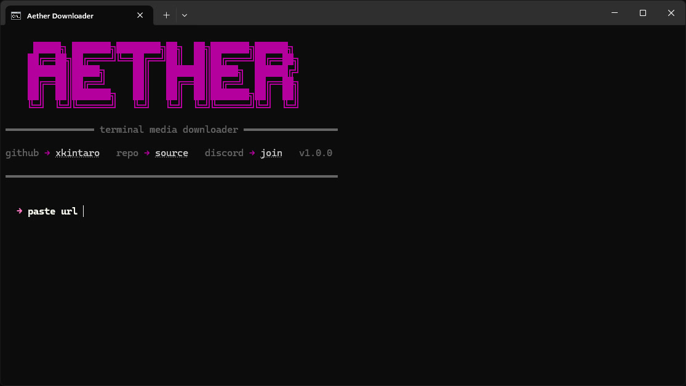
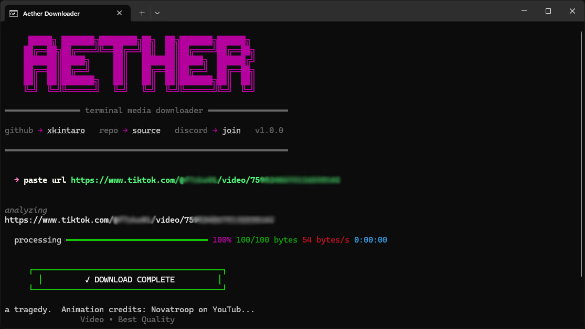

<div align="center">
  
  <br />
  <br />

  [](https://www.python.org/)
  [](https://github.com/yt-dlp/yt-dlp)
  [](https://rich.readthedocs.io/)

  <p align="center">
    <b>A streamlined and beautiful command-line video downloader</b>
    <br />
    <br />
    <a href="#features">Features</a> •
    <a href="#technologies">Technologies</a> •
    <a href="#installation">Installation</a> 
  </p>
</div>

---

## 📋 About

**Aether Downloader** is a modern and streamlined command-line application built with Python that allows you to easily download videos from platforms like YouTube, TikTok, and more. It leverages the power of `yt-dlp` under the hood and provides a beautiful, responsive terminal interface using `rich` and `questionary`.



## <a id="features"></a> ✨ Features

### ⬇️ Simple Video Downloading
- **One-Step Process**: Just paste your video URL and hit enter. The application automatically fetches the video in the best available quality.
- **Wide Platform Support**: Supports YouTube, TikTok, Instagram, and any other platform compatible with `yt-dlp`.

### 🎨 Beautiful Terminal UI
- **Rich Output**: Enjoy a colorful, intuitive, and modern command-line experience.
- **Progress Tracking**: Real-time, smooth download progress bar with detailed information including file size, download speed, and ETA.

### ⚡ Streamlined Workflow
- **Auto-Update**: The application can automatically check and update `yt-dlp` to ensure maximum compatibility.
- **Quick Controls**: Easily exit the prompt by typing `exit`, `q`, `quit`, or by simply leaving it empty.
- **Automatic Folder Management**: Downloads are automatically saved to a dedicated `Downloads` folder within the run path.



## <a id="technologies"></a> 🛠️ Technologies

- **Language:** Python
- **Core Downloader:** `yt-dlp`
- **UI Components:** `rich`, `questionary`
- **Networking:** `certifi`
- **Packaging:** `pyinstaller`

## <a id="installation"></a> 🚀 Installation

1. **Clone the repository:**

   ```bash
   git clone https://github.com/xkintaro/aether-downloader.git
   cd aether-downloader
   ```

2. **Install dependencies:**

   ```bash
   pip install -r requirements.txt
   ```

   Or use the provided batch file on Windows:

   ```
   install-requirements.bat
   ```

3. **Run the application:**

   ```bash
   python app.py
   ```

   Or use the provided batch file on Windows:

   ```
   run.bat
   ```

---

<p align="center">
  <sub>❤️ Developed by Kintaro.</sub>
</p>
