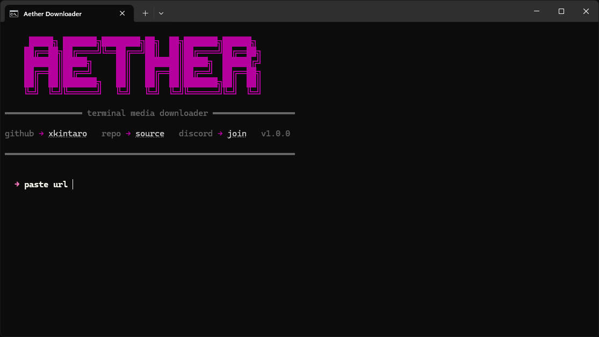
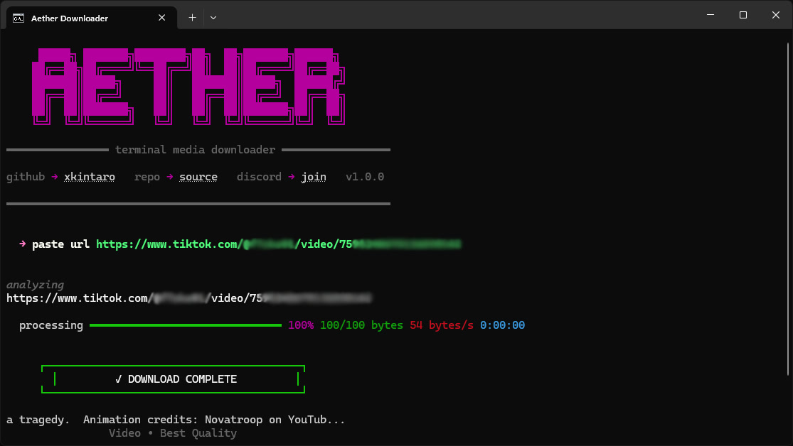

<a href="README.md">
  
</a>

<a href="README-TR.md">
  
</a>

  <br />
  <br />

<div align="center">
  
  <br />
  <br />

  <p>
    A streamlined and beautiful command-line video downloader
  </p>

  
  
  
  

  <p>
    <a href="#features">Features</a> •
    <a href="#technologies">Technologies</a> •
    <a href="#installation">Installation</a> •
    <a href="#license">License</a> •
    <a href="#gallery">Gallery</a>
  </p>

  <br />
  <br />
</div>

## 📋 About

**Aether Downloader** is a modern and sleek command-line application built with Python that allows you to easily download videos from platforms like YouTube, TikTok, and more. It leverages the power of `yt-dlp` under the hood and provides a beautiful, responsive terminal interface using the `rich` and `questionary` libraries.



## <a id="features"></a> ✨ Features

### Simple Video Downloading
- **One-Step Process**: Just paste the video URL and press Enter. The application automatically downloads the video in the best available quality.
- **Wide Platform Support**: Supports YouTube, TikTok, Instagram, and all other platforms compatible with `yt-dlp`.

### Sleek Terminal Interface
- **Rich Output**: Enjoy a colorful, intuitive, and modern command-line experience.
- **Progress Tracking**: Real-time, smooth download progress bar with detailed information including file size, download speed, and estimated time of arrival (ETA).

### Accelerated Workflow
- **Automatic Updates**: The application can automatically check for and update `yt-dlp` to ensure maximum compatibility.
- **Quick Controls**: Easily exit the application by typing `exit`, `q`, `quit`, or leaving the input field blank.
- **Automatic Folder Management**: Downloads are automatically saved to a dedicated `Downloads` folder within the working directory.

## <a id="technologies"></a> 🛠️ Technologies

- **Python**: The core programming language that forms the project's logic and operation.
- **yt-dlp**: The engine that handles video/audio downloads from YouTube and similar sites.
- **rich**: Creates colorful output, progress bars, and aesthetic tables in the terminal.
- **questionary**: Enables interactive and stylish selection menus with the user via the terminal.
- **certifi**: SSL certificate verification package required for secure connections.
- **pyinstaller**: Converts Python code into a portable executable (.exe) file for the end user.

## <a id="installation"></a> 🚀 Installation

1. **Clone the repository:**

   ```bash
   git clone https://github.com/xkintaro/aether-downloader.git
   cd aether-downloader
   ```

2. **Install dependencies:**

   ```bash
   pip install -r requirements.txt
   ```

3. **Run the application:**

   ```bash
   python app.py
   ```

## 📄 License <a id="license"></a>

This project is licensed under the MIT License. See the [LICENSE](LICENSE) file for details.

## 🖼️ Gallery <a id="gallery"></a>



#

<p align="center">
  <sub>❤️ Developed by "Mustafa TAŞAL" (kintaro)</sub>
</p>